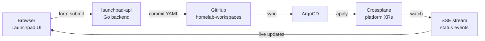

# Launchpad

Self-service platform UI for my homelab cluster. Describe what you want running. Watch it go green. No kubectl, no YAML, no cluster access required.

Live at [launchpad.mattjarrett.dev](https://launchpad.mattjarrett.dev).

## How it works

Launchpad is a thin UI over a GitOps loop. It never talks to Kubernetes directly — it talks to [launchpad-api](https://github.com/cujarrett/launchpad-api), which commits platform XR YAML to GitHub. ArgoCD picks it up, Crossplane provisions the resources, and status flows back to the browser over SSE.



The write path is GitHub. The read path is a Kubernetes watch over SSE. They never mix.

## Guest sandbox

No login required. Click **Try a Sandbox**, pick a name, choose resources — an API, database, cache, object storage — and watch a real workload provision against the cluster in real time. Sandboxes expire after 10 minutes and clean themselves up.

Each sandbox gets a dedicated namespace, its own service bindings, and (for AWS resources) scoped IAM roles via workload identity. It's the full platform, not a demo mode.

## Architecture

- **Angular standalone components** — no NgModules
- **Signals + zoneless change detection** — no Zone.js, no async pipe
- **MSAL PKCE** — auth via Azure Entra ID; tokens never touch the server except as Bearer headers
- **SSE for live updates** — one persistent connection per browser tab; no polling

## Local dev

```bash
npm install
npm start   # proxies /api → localhost:8080 via proxy.conf.json
```

[launchpad-api](https://github.com/cujarrett/launchpad-api) must be running locally for any real functionality. Set `ENTRA_AUTH_DISABLED=true` there to skip JWT validation during local dev.
