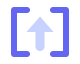

# Brand

The Launchpad mark is a pair of brackets holding an ascending arrow.



Brackets because Launchpad isn't the vehicle — it's the *declaration* that puts something in the air, and brackets are the punctuation of every manifest it commits. The mark reads three ways at once: declaration, deployment, and containment.

A rocket was the obvious choice and the wrong one. It describes cargo rather than the product, and it's what the stock emoji already said.

## Files

| File | Use |
|---|---|
| [launchpad-mark.svg](launchpad-mark.svg) | Dark grounds. Indigo brackets, pale arrow. |
| [launchpad-mark-light.svg](launchpad-mark-light.svg) | Light grounds. Tint flips so the arrow stays the darker shape. |
| [launchpad-mark-mono.svg](launchpad-mark-mono.svg) | Single colour via `currentColor`. Must be inlined — see below. |
| [identity.html](identity.html) | The full presentation — size proofs, ground tests, and the directions that were rejected. Open it in a browser. |

In the app the mark is a component, not a file — see [launchpad-mark.ts](../src/app/core/launchpad-mark.ts). It takes `--mark-size` from the parent and animates on load. The favicon is a separate copy at [public/favicon.svg](../public/favicon.svg) with a `prefers-color-scheme` block, because a favicon has to survive both a light and a dark browser chrome.

## Rules

**The arrow is filled, never stroked.** It started as two round-joined strokes, which blob into a mushroom above about 100px. If you redraw it, keep the triangle a real polygon.

**Weight contrast is what makes it work small.** Hairline brackets against a heavy arrow keep two distinct shapes at 18px. Even the weights out and it turns to mush in a tab bar.

**Don't put the mark on a rounded tile.** A filled squircle with a shape inside reads as the eject button. This killed several stronger-looking directions; `identity.html` shows them.

**The mono variant has to be inlined.** An SVG loaded through `` is an isolated document, so `currentColor` resolves to black instead of inheriting. Paste the markup into the page, or use the two-colour files.

## Wordmark

Lowercase `launchpad` in the same monospace the app uses for every resource name, with the tonal shift on `pad`:

```html
<span class="app-nav-wordmark">launch<b>pad</b></span>
```

Mono because that's the product's own voice — every resource name in Launchpad is already set in it — rather than a display face borrowed from somewhere else.

## Colour

| Token | Value | Where |
|---|---|---|
| Brackets | `#6366f1` | `--color-accent` |
| Arrow | `#c7d2fe` | Also the `pad` half of the wordmark |
| Brackets, light ground | `#a5b4fc` | Recedes so the arrow leads |
| Arrow, light ground | `#4f46e5` | `--color-accent-hover` |

The sandbox SPA in [launchpad-api](https://github.com/cujarrett/launchpad-api) carries the same mark and the same tokens, so a provisioned sandbox looks like it came from the product that provisioned it.
